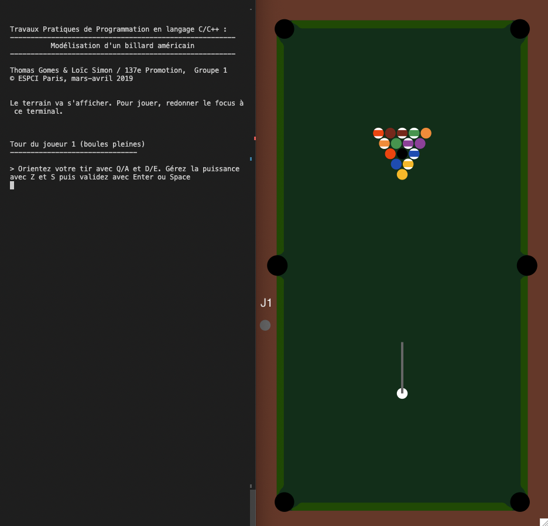

# CBillard

Jeu de billard en C/C++ (projet scolaire ESPCI Paris - PSL).

Réalisé à l'issue d'un cours de programmation en C, en mars-avril 2019.

# Dépendances

Ce projet utilise la bibliothèque [Cairo Graphics](https://www.cairographics.org).
Son installation est requise pour la compilation du jeu.

Il nécessite également un serveur X en cours d'exécution ainsi que la bibliothèque C `Xlib`.

# Compilation

Compilez le programme à l'aide de l'instruction

```bash
make billard
```

Aucune configuration automatique n'était réalisé, il est possible qu'il faille modifier
le [`Makefile`](./Makefile) pour adapter l'emplacement des bibliothèques C à votre système.

# Usage

Lancez le programme à l'aide de l'instruction

```bash
./billard
```

Une fenêtre X devrait s'ouvrir. Si ce n'est pas le cas, vérifiez l'installation et l'état du
serveur X et la variable d'environnement $DISPLAY$.

Il suffit ensuite de suivre les instructions dans le terminal.



# Contributions

Ce projet est un vieux projet étudiant déposé ici pour archive ; toutefois si qui que ce soit
souhaite y contribuer pour une raison obscure, il y est bienvenu.

# Copyright

© 2019 Thomas Gomes & Loïc Simon – Distribué sous licence MIT (voir [`LICENSE`](./LICENSE))
